# weather-dashboard
## Featuring OpenWeather API

    
 
## :book: Table of Contents
1. [Project Criteria](#criteria)
2. [Challenges](#challenges)
3. [Contributions](#contributions)
4. [UV Index](#uvindex)
5. [Deployed Application](#deployed)
6. [Screenshot of App](#screenshot)

### :star: Project Criteria: 
- User can search for a city using the OpenWeather API.
- User's result shows current weather conditions as well as a 5-day forecast.
- Current weather includes a UV index whose color changes based on whether conditions are favorable, moderate, or severe.
- User's city search history is viewable.
- User's most recent city search is stored in `localStorage`.

### :mountain: Challenges: 
- A final criteria was to make the search history 'researchable' - ie, when User clicks on a city in the search history they are again presented with the weather results for that city. Everything I tried at the time was incredibly buggy, but I will revisit this code in the future.
- I didn't want to use moment.js for dates since that is deprecated, so I used **Luxon** for the first time! The documentation was not as beginner-friendly as moment.js, but I eventually figured it out. :)

### :heart: Contributions: 
- Weather icons were created by Graphic Designer Ashely Jacer and can be found at [manifestinteractive's GitHub repo](https://github.com/manifestinteractive/weather-underground-icons)

### :sunglasses: UV Index:
<table>
  <tr>
   <td>Green</td><td>Yellow</td><td>Orange</td><td>Red</td><td>Purple</td>
  </tr>
  <tr>
   <td> 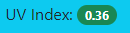 </td>
   <td> 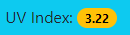 </td>
   <td> 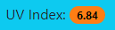 </td>
   <td> 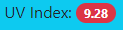 </td>
   <td> 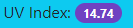 </td>
  </tr>
  <tr>
   <td>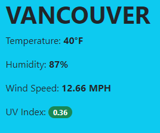</td>
   <td>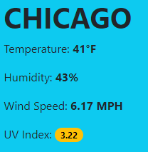</td>
   <td>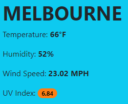</td>
   <td>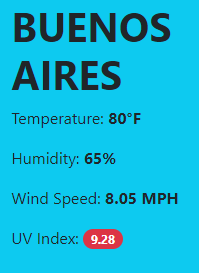</td>
   <td>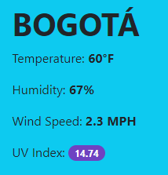</td>
  </tr>
 </table>
 
### :mage: Deployed Application: 
[Link to Deployed Application](https://marina-russ.github.io/weather-dashboard/)

### :camera: Screenshot of App:
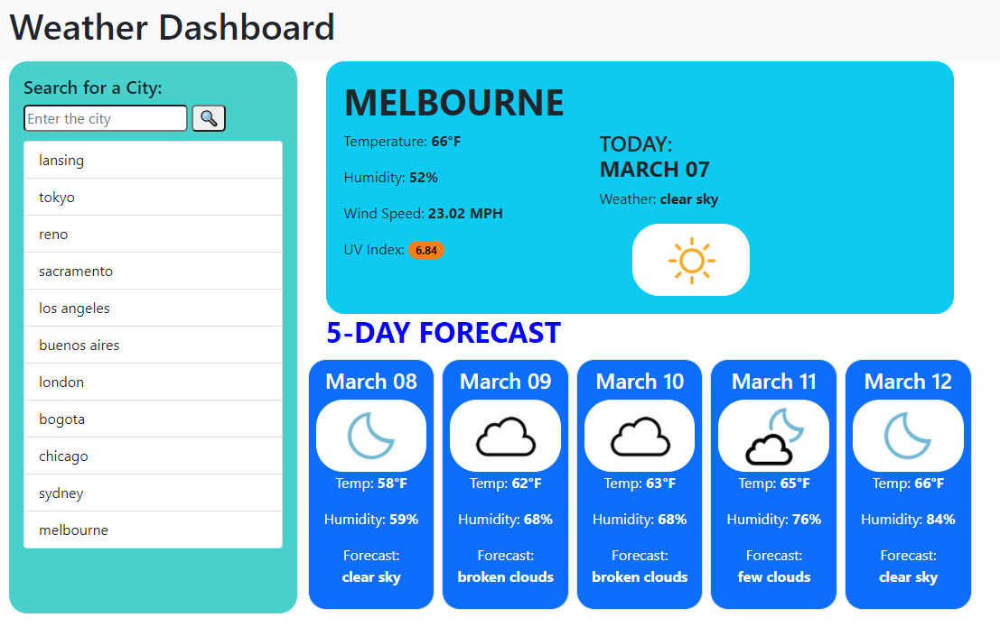
